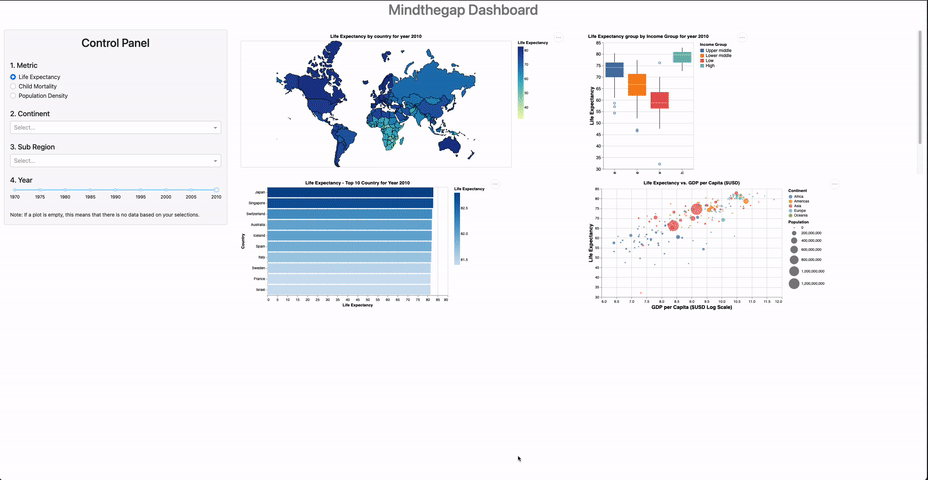

# mindthegap

This repository contains our work as it relates to an interactive dashboard built with [Dash](https://plotly.com/dash/) and [Altair](https://altair-viz.github.io/), for purposes of analyzing data collected by the [Gapminder](https://www.gapminder.org/) organization.

You can find the interactive dashboard at this [link](https://dsci532-2022-mindthegap.herokuapp.com/).

## What are we doing?

### The problem

- Life expectancy is one of the most important metrics that gauge the well-being of a population, as it captures many aspects of public health.
- Further, as life expectancy unequivocally states the average age of death, many research groups (e.g. demographers and sociologists), are keen on following its trend in order to assess the conditions of population health.
- In addition, there are other related metrics that would further assist researchers in understanding life expectancy, which include child mortality and population density.
- While larger research groups and/or companies may have the ability to build savvy dashboards for their own teams, smaller groups may not be able to due to a lack of time, skills required to do so, or a lack of budgetary spending.

### The solution

- In order to address the problem we have build an interactive dashboard that research groups of any size can use to quickly and efficiently visualize life expectancy, child mortality, and population density metrics as it relates to all the countries across the world.
- Specifically, our dashboard enables a user to freely explore the Gapminder [dataset]((https://raw.githubusercontent.com/UofTCoders/workshops-dc-py/master/data/processed/world-data-gapminder.csv).) with a simple set of controls/filters, which provide the means to interactively change/update the visualizations that are displayed.
- With our visualizations at the tip of their fingers, researchers can immediately identify key trends and perform analysis on the desired metric(s) of interest.

## How to use the dashboard



### Control panel

The control panel of our dashboard allows you to perform the following:

- Select a metric of interest to visualize
- Filter the visualizations based on a specific continent of interest
- Filter the visualizations based on a specific sub-region of a continent of interest
- Filter the visualizations for a specific year from 1970 to 2010, with 5 year increments

### Visualizations

Our dashboard contains four key visualizations arranged in a 2x2 grid:

1. A global map that is coloured as a heat map based on the selected metric of interest in the control panel.
2. A boxplot that displays the distribution of the selected metric of interest for each of the following income groups: upper middle, lower middle, low, and high.
3. A bar chart that shows the top 10 countries for the selected metric of interest, in terms of the countries with the top 10 highest values for this metric.
4. A bubble chart that displays the GDP per capita (in $USD) on a log scale vs. the selected metric of interest.  The size of the bubbles is based on the population of the countries displayed in the chart.

## Usage

To replicate the analysis, clone this GitHub repository, install the dependencies listed below, and run the following command at the command line / terminal from the root directory of this project:

#### 1. Using Docker

Install [Docker](https://www.docker.com/get-started). Run the following command in the command line from the root directory of this project:

To build the docker image, run the following command at the command line/terminal from the root directory of this project:

    docker-compose build

To run the docker container, run the following command at the command line/terminal from the root directory of this project:

    docker-compose up

Open your browser at http://0.0.0.0:8000 to assess the app.
#### 2. Without using Docker

To replicate the analysis, clone this GitHub repository, install the dependencies listed below, and run the following command at the command line / terminal from the root directory of this project.

Install all the dependencies listed under the "Dependencies" header. To create and activate the environment, run the following commands in the command line from the root directory of this project:

``` shell
# create the virtual env
conda create --name mindthegap --file requirements.txt

# activate it
conda activate mindthegap

# Run the app
python src/app.py
```

Open your browser at http://0.0.0.0:8000 to assess the app.
## Contributions

### Core contributors

| Core contributor| Github.com username|
|------------------- |-------------------|
| Harry Chan | [@harryyikhchan](https://github.com/harryyikhchan) |
| Navya Dahiya | [@nd265](https://github.com/nd265/) |
| Nico Van den Hooff | [@nicovandenhooff](https://github.com/nicovandenhooff) |
| James Kim | [@jamesktkim](https://github.com/jamesktkim) |

### How to contribute

Feedback and suggestions are always welcome! Please read [the contributing guidelines](https://github.com/UBC-MDS/mindthegap/blob/main/CONTRIBUTING.md) to get started, then:

1. Fork our repo and perform the required set up

Go to <https://github.com/UBC-MDS/mindthegap> and click the “fork” button to create your own copy of the project.  Then, perform the following at the command line:

```{bash}
# clone your fork to your local
git clone https://github.com/your-username/mindthegap.git

# change directory to your local repository
cd mindthegap

# add our upstream repository
git remote add upstream https://github.com/UBC-MDS/mindthegap
```

Now, create and activate a virtual environment with [conda](https://docs.conda.io/en/latest/) at the command line as follows:

```{bash}
# create the virtual env
conda create --name mindthegap --file requirements.txt

# activate it
conda activate mindthegap
```

2. Develop your contribution:

- Pull the latest changes from upstream:

```{bash}
git checkout main
git pull upstream main
```

- Create a branch for the feature you want to work on:

```{bash}
git checkout -b feature-X
```

- Commit locally as you progress (`git add` and `git commit`)

3. To submit your contribution

- Push your changes back to your fork on GitHub:

```{bash}
git push origin feature-X
```

4. Submit a pull request

- Go to GitHub. The new branch will show up with a green Pull Request button. Make sure the title and message are clear, concise, and self- explanatory. Then click the button to submit it.
- If your commit introduces a new feature or changes functionality, post on the mailing list to explain your changes. For bug fixes, documentation updates, etc., this is generally not necessary, though if you do not get any reaction, do feel free to ask for review.

## Support

If you run into troubles, please [check the issue list](https://github.com/UBC-MDS/mindthegap/issues) to see if your problem has already been reported or to open new issues.

## Code of conduct

In the interest of fostering an open and welcoming environment, we as contributors and maintainers pledge to making participation in our project and our community a harassment-free experience for everyone, regardless of age, body size, disability, ethnicity, gender identity and expression, level of experience, nationality, personal appearance, race, religion, or sexual identity and orientation. Detailed descriptions of these points can be found in [`CODE_OF_CONDUCT.md`](https://github.com/UBC-MDS/mindthegap/blob/main/CODE_OF_CONDUCT.md).

## License

`mindthegap` was created by Harry Chan, Navya Dahiya, Nico Van den Hooff and James Kim. It is licensed under the terms of the MIT license.
